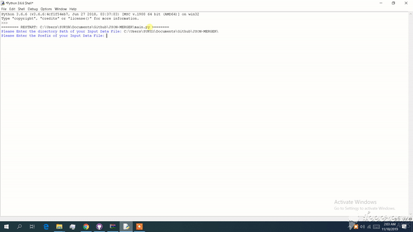

# JSON-MERGER
### JSON MERGER is a Python application which merge JavaScript Object Notation file format.
 

## HOW to USE?
## Requirements
   Python 3
 

## To use JSON-MERGER, Follow the Follwing steps:  
 

1. Download JSON-MERGER. 
 
2. Run "main.py" using python. 

3. Input your json data file location. 
  
 4. Input prefix name of your data file location.  
  (Eg. Input files: "data1.json", "data2.json", "data3.json". Here "data" is your prefix name.) 
  
5. Enter max size of output file you want to generate in bytes. 
  (Eg "4000" which is equal to 4kb.) 
 
6. The merged json output file "merge.json" will be generated in the input data file location. 
 ("merge.json") 
 

  
  ### Only if entered max file size is low. 
  
   
   
   
  7.If the size you entered was low. The program will ask for minimizing the json file.
  [The prefered size is slightly more. Can I please minimize the json removing all indentations Y/N] 
   Give Yes ["Y"] 
  8. If prefferred output size is too low. It will delete the file. Run the program with higher preffered size. 
  
  
